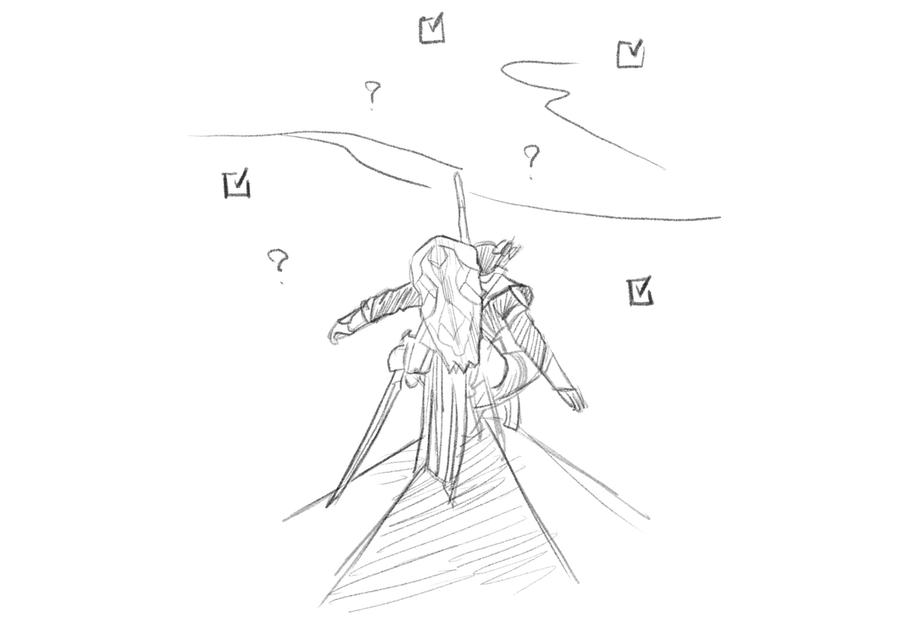

Assassin's Creed Origin is not challenging game like any Soul titles and not revolutionize any genre and furthermore it has a lot of repetitive gameplays. But if you are a kind of person like me that loves and satisfy ticking off a small and easy task one by one no matter how boring it is, this game is for you.

The visual and sound feedback when you have any progress is amazing, a golden aura and small ripple of wind when you leveling up, a ding sound and small white dots float up in the air when you pick a loot (big sound and visual if you get a rare one), the gold particles fly from XP points to your progress bar. Everything is crafted to make you feels so satisfy and crave for more. Just a little more before I'm going to bed (and you know the result).

Plus, the combat system has improved a lot since my last play of the series many years ago (Brotherhood maybe?), it is not counter button mashing anymore. You can now change your gears, shield, various type of melee weapons and bows which they a have slightly different style of gameplay for you to use and collect.

The Trophies also not hard to complete, no skill required just need more time after completed all the main quests. I got the Platinum in like, 60-70 hours.
