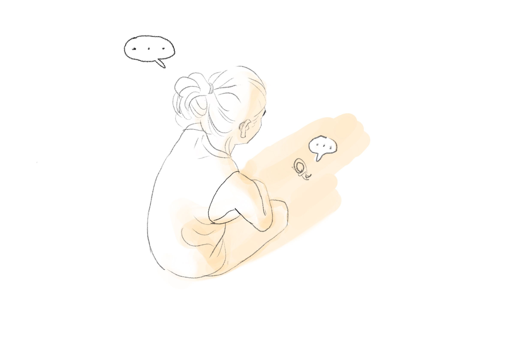
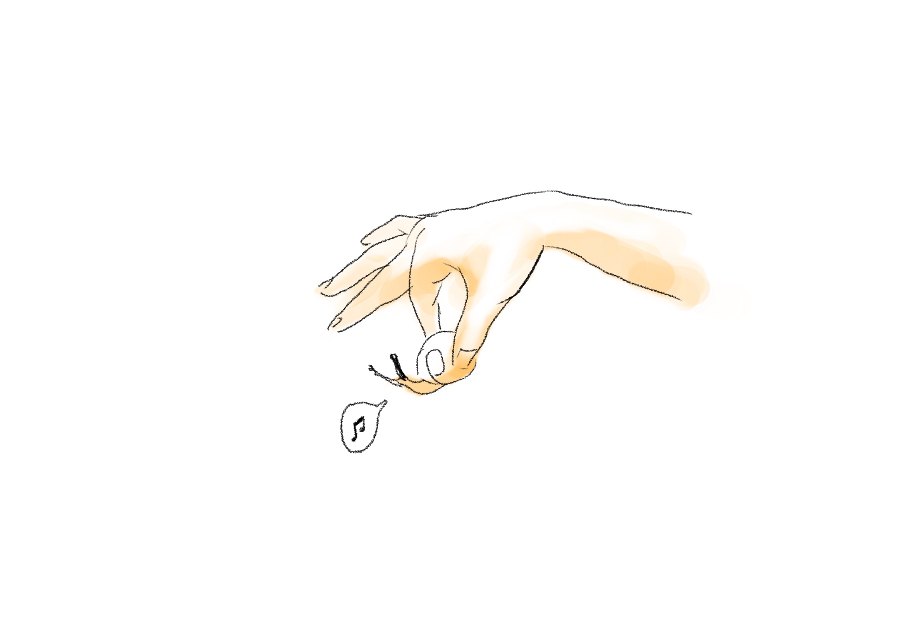
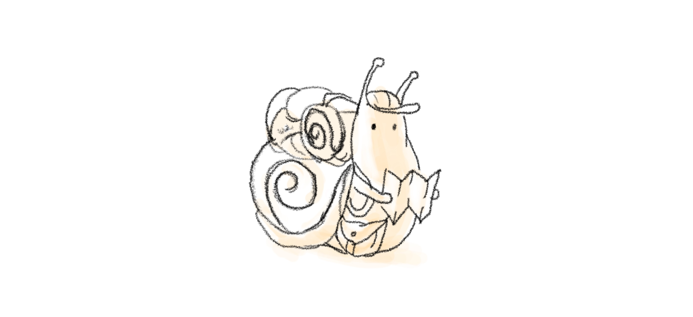
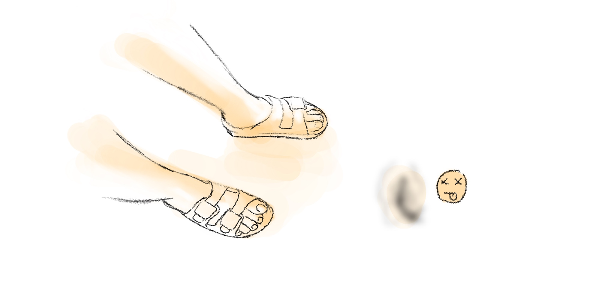

Sometimes when she was getting out of her house, she saw a snail on the pathway.

She often moves the little friend out of the way because she was afraid that it might be harm by someone who didn't see it.

Why is this lad so stubborn? she thought. Didn't it afraid to die or something? She fancied that this guy might be an explorer, a hope of its village that has to go out to the outside world to bring food back. She muddled without any knowledge of this particular monster.

Today while she is walking out of her place to work as usual.

She saw a crushed snail right over there.

