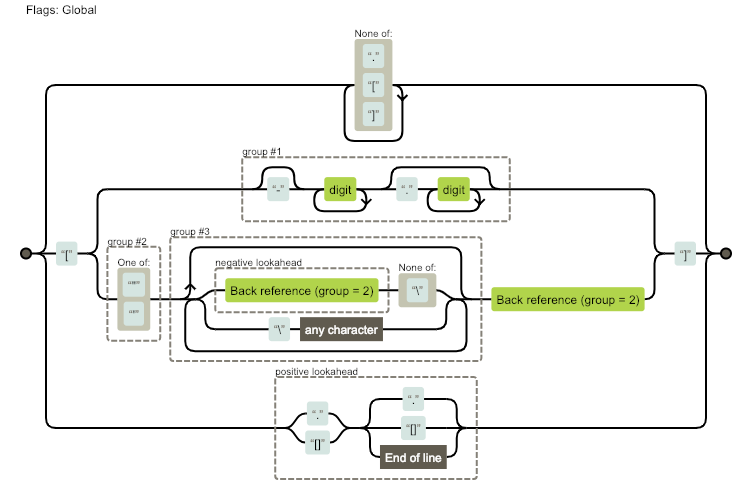

I will begin this series with [`_.get`](https://lodash.com/docs/4.17.11#get) which I used most often compare to all Lodash's functions.

This is entire code of the function.
```js
/**
    * Gets the value at `path` of `object`. If the resolved value is
    * `undefined`, the `defaultValue` is returned in its place.
    *
    * @static
    * @memberOf _
    * @since 3.7.0
    * @category Object
    * @param {Object} object The object to query.
    * @param {Array|string} path The path of the property to get.
    * @param {*} [defaultValue] The value returned for `undefined` resolved values.
    * @returns {*} Returns the resolved value.
    * @example
    *
    * var object = { 'a': [{ 'b': { 'c': 3 } }] };
    *
    * _.get(object, 'a[0].b.c');
    * // => 3
    *
    * _.get(object, ['a', '0', 'b', 'c']);
    * // => 3
    *
    * _.get(object, 'a.b.c', 'default');
    * // => 'default'
    */
   function get(object, path, defaultValue) {
     var result = object == null ? undefined : baseGet(object, path);
     return result === undefined ? defaultValue : result;
   }
```

It begins with [`JSDoc`](http://usejsdoc.org), first 3 lines are description which is simple and clear. `@static`, `@memberOf`, `@since` and `@category` are new to me because I rarely write JSDoc.
- Words prefix with `@` symbol are called ["tag"](http://usejsdoc.org/about-block-inline-tags.html)
- [`@static`](http://usejsdoc.org/tags-static.html) means the function is static.
- [`@memberOf _`](http://usejsdoc.org/tags-memberof.html) means the function is member of `_`
- [`@since 3.7.0`](http://usejsdoc.org/tags-since.html) means the function is in this repo since version 3.7.0
- [`@category Object`](https://github.com/ErnstHaagsman/jsdoc-plugins/blob/master/categories.md) means the function is in `Object` category

First statement of the function is validating `object`
```js
var result = object == null ? undefined : baseGet(object, path);
```

Interesting that it use `==` (eqeq) instead of `===` (eqeqeq) why? in [eslint `no-eq-null` rule](https://eslint.org/docs/rules/no-eq-null) the value can be both `null` or `undefined`. This is convenient way for checking only `null` or `undefined` but not include `''`, `0` or `false`

```js
const test1 = null;
const test2 = undefined;
test1 == null // true
test2 == null // true
```

When `object` is not `null` or `undefined` the function call `baseGet`.

```js
/**
* The base implementation of `_.get` without support for default values.
*
* @private
* @param {Object} object The object to query.
* @param {Array|string} path The path of the property to get.
* @returns {*} Returns the resolved value.
*/
function baseGet(object, path) {
 path = castPath(path, object);

 var index = 0,
     length = path.length;

 while (object != null && index < length) {
   object = object[toKey(path[index++])];
 }
 return (index && index == length) ? object : undefined;
}
```

In `JSDoc` there is 1 new tag [`@private`](http://usejsdoc.org/tags-private.html) means that we can not use this function.

The first line it call `castPath` another private method to convert `path` to an array
```js
path = castPath(path, object);

...

/**
 * Casts `value` to a path array if it's not one.
 *
 * @private
 * @param {*} value The value to inspect.
 * @param {Object} [object] The object to query keys on.
 * @returns {Array} Returns the cast property path array.
 */
function castPath(value, object) {
  if (isArray(value)) {
    return value;
  }
  return isKey(value, object) ? [value] : stringToPath(toString(value));
}

```
What is `isKey()` do? The description is pretty clear. Inside it has some checks that I'm not gonna dive any further.

```js
/**
 * Checks if `value` is a property name and not a property path.
 *
 * @private
 * @param {*} value The value to check.
 * @param {Object} [object] The object to query keys on.
 * @returns {boolean} Returns `true` if `value` is a property name, else `false`.
 */
function isKey(value, object) {
  if (isArray(value)) {
    return false;
  }
  var type = typeof value;
  if (type == 'number' || type == 'symbol' || type == 'boolean' ||
      value == null || isSymbol(value)) {
    return true;
  }
  return reIsPlainProp.test(value) || !reIsDeepProp.test(value) ||
    (object != null && value in Object(object));
}
```

If the `value` is a key of `object`, it will be returned as an array but if not, it will be converted to string and passed into `stringToPath()`.

```js
return isKey(value, object) ? [value] : stringToPath(toString(value));
```

```js
/**
 * Converts `string` to a property path array.
 *
 * @private
 * @param {string} string The string to convert.
 * @returns {Array} Returns the property path array.
 */
var stringToPath = memoizeCapped(function(string) {
  var result = [];
  if (string.charCodeAt(0) === 46 /* . */) {
    result.push('');
  }
  string.replace(rePropName, function(match, number, quote, subString) {
    result.push(quote ? subString.replace(reEscapeChar, '$1') : (number || match));
  });
  return result;
});
```
After a little exploration of `memoizeCapped` I decided to not go deeper into it but just to note that it use for caching a function.

First `if` statement is checking whether first character is `.` or not. I do not need to find that what `charCode` number 46 is because it was put as a comment behind the statement. Awesome!

Then there is [`string.replace()`](https://developer.mozilla.org/en-US/docs/Web/JavaScript/Reference/Global_Objects/String/replace).

What is `rePropName`? The description is clear enough. Notice that they prefix any regex variables with `re`

```js
/** Used to match property names within property paths. */
...
rePropName = /[^.[\]]+|\[(?:(-?\d+(?:\.\d+)?)|(["'])((?:(?!\2)[^\\]|\\.)*?)\2)\]|(?=(?:\.|\[\])(?:\.|\[\]|$))/g;
```

I never use it with a callback function let's see what is it for.
> `function` (replacement)
A function to be invoked to create the new substring to be used to replace the matches to the given regexp or substr.

Not quite fully understand but they have more explanation [here](https://developer.mozilla.org/en-US/docs/Web/JavaScript/Reference/Global_Objects/String/replace#Specifying_a_function_as_a_parameter).

So `number`, `quote` and `subString` are result from each capture groups. What are they capture? I used [Regexper](https://regexper.com/) to visualized it. [Link to full picture](https://regexper.com/#%2F%5B%5E.%5B%5C%5D%5D%2B%7C%5C%5B%28%3F%3A%28-%3F%5Cd%2B%28%3F%3A%5C.%5Cd%2B%29%3F%29%7C%28%5B%22'%5D%29%28%28%3F%3A%28%3F!%5C2%29%5B%5E%5C%5C%5D%7C%5C%5C.%29*%3F%29%5C2%29%5C%5D%7C%28%3F%3D%28%3F%3A%5C.%7C%5C%5B%5C%5D%29%28%3F%3A%5C.%7C%5C%5B%5C%5D%7C%24%29%29%2Fg).



From the picture above, the regex is not capture anything that's not start and end with `[]` and must be any character inside. Then it will be separated into 3 groups 1) is number that will goes into `number` variable 2) If first character start with `"` or `'` will goes into `quote` variable 3) Is any thing after 2). (Oh my goodness, I just realized that [Regexper](https://regexper.com/) is so useful)

So in replacer function, if `quote` has no value it will be returned as `number` or `match` but if it has, `subString` will be replace by using regex `reEscapeChar`

```js
result.push(quote ? subString.replace(reEscapeChar, '$1') : (number || match));
```

```js
/** Used to match backslashes in property paths. */
var reEscapeChar = /\\(\\)?/g;
```

The statement `subString.replace(reEscapeChar, '$1')` is removing `\` from `subString`. Then it return the `result` value that will always be an array.

Now to back to `baseGet()`. Statement `path = castPath(path, object);` is to convert input `path` to an `Array<string>`. Next statement is `while` loop to get value of `object` from `path`.

```js
// baseGet
var index = 0,
    length = path.length;

while (object != null && index < length) {
  object = object[toKey(path[index++])];
}
```
Inside `toKey()`, the return statement is interesting.

```js
/**
 * Converts `value` to a string key if it's not a string or symbol.
 *
 * @private
 * @param {*} value The value to inspect.
 * @returns {string|symbol} Returns the key.
 */
function toKey(value) {
  if (typeof value == 'string' || isSymbol(value)) {
    return value;
  }
  var result = (value + '');
  return (result == '0' && (1 / value) == -INFINITY) ? '-0' : result;
}
```
- Turn value to string using `+ ''` but if value is `-0` then `-0 + ''` will be `'0'`.
- Check if `result` is `0` (number or string) and check if value is `-0` or not.
- If yes, return `-0`. I couldn't figure out why it has to check the value because `object[0] === object[-0]`

```js
// Declaration of INFINITY
var INFINITY = 1 / 0,
// return of `toKey`
return (result == '0' && (1 / value) == -INFINITY) ? '-0' : result;
```

For example, if we give `object` and `path`
```js
var object = {
  a: {
    b: {
      c: 'This is it'
    }
  }
}
var path = ['a', 'b', 'c']
```
1st iteration, value of `object` will be `{b:{c:{'This is it'}}}`.
2nd will be `{c:{'This is it'}}`.
And the last one will be `'This is it'`.

In the `return` of `baseGet()`
```js
return (index && index == length) ? object : undefined;
```

`(index && index == length)` is checking if the iteration is valid. If yes, it return `object` otherwise return `undefined`

Now get back to `get()` (finally!). The last statement is pretty straightforward.
```js
return result === undefined ? defaultValue : result;
```

<div style="margin:1em 0;width:100%;font-size:24px;font-weight:bold;text-align:center">...</div>

Things I learned from reading `_.get`
- Usages of [JSDoc](http://usejsdoc.org/), which is very useful for readers of a function if you write them well.
- Using `== null` to check `null` and `undefined`.
- Simple but helpful comment in `if (string.charCodeAt(0) === 46 /* . */) {`.
- Usages of [`string.replace`](https://developer.mozilla.org/en-US/docs/Web/JavaScript/Reference/Global_Objects/String/replace)
  - Using replacer function.
  - Using `$1`.
- Usefulness of [Regexper](https://regexper.com/).
- `-0 + '' === '0'`. [demo](https://jsfiddle.net/Warizz/1p62jLkm/14/) <script async src="//jsfiddle.net/Warizz/1p62jLkm/8/embed/js,result/dark/"></script>
- `0 === -0`(in JS). [demo](https://jsfiddle.net/Warizz/t9cw0x6L/5/), [Are +0 and -0 the same?](https://stackoverflow.com/questions/7223359/are-0-and-0-the-same)
