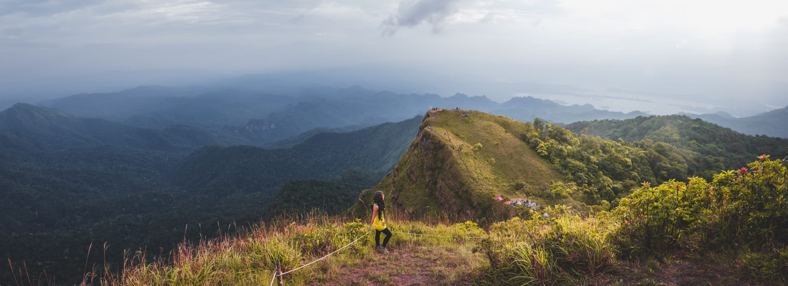
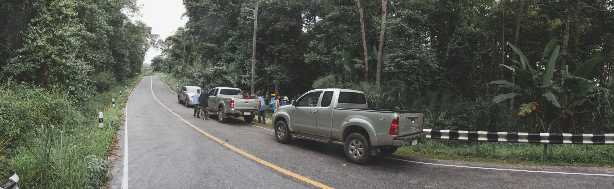
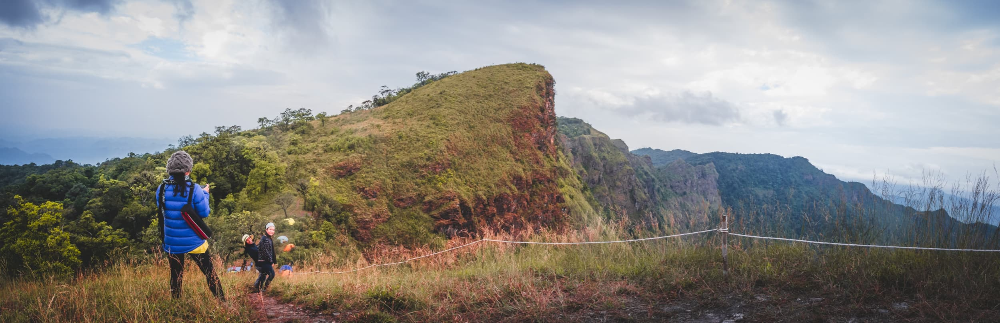
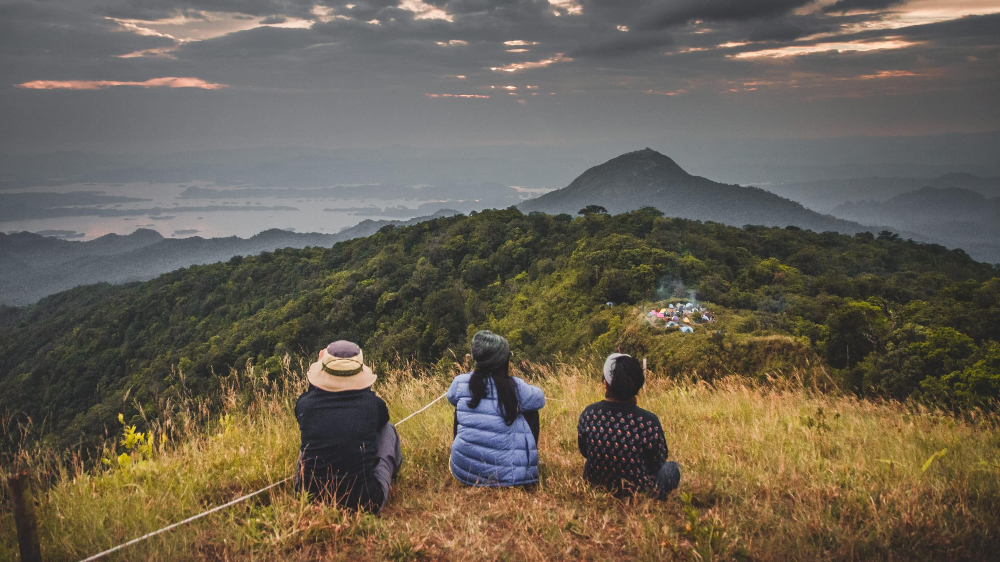

**Khao San Nok Wua** *(Khao=mountain, San=ridge, Nok=hump and Wua=Cow)* is located within the area of [Khao Lam national park](https://goo.gl/maps/xTzSjcVfULo). You need only 1 and a half day and 1 night for the whole trip (excluded traveling from/to your place). Walking up is not difficult, there are only 2 kms before base camp that are very steep elevation, it took around 3 - 5 hours and not more than half an hour for each of both mountain tops. Camp area is settle around cliff which you can see panorama view of the national park and [Vajira-longkorn dam](https://goo.gl/maps/nuj4p3adCWG2).

Booking is not easy if you are foreigners because you have to send some documents to officers and pay register fee beforehand, details are [here but only in Thai](https://www.facebook.com/อุทยานแห่งชาติเขาแหลม-330864760360387/).

On the appointment date, at [Pom Pee view point](https://goo.gl/maps/ikhTcSF4qnB2), registration open from 8 - 10am. Weigh your belongings if need porters. When everything is ready, officers will bring you to the starting point by truck which takes around 10 minutes.

Hiking up to base camp is split into 7 rest areas. First is starting point (I will call it No. 0) after that are rest area No. 1 - 5 the last one is camp area. Walking from No. 0 to No. 4 is not difficult but going from No. 4 to camp is quite tiresome because there are some range of the route that are very steep and slippery therefore national park officers has prepared rope to help you go up easier.

Took me 3 hours to get to the camp area. We have had to wait for porters to come so we walked to take a look around and find spot for our tents. 10 - 20 minutes later, porters came and set up camp for us. They also brought us gallons of water and asked if we want to make a camp fire.

We went there on the weekend so the place were crowded. Officer that came with us said on that day there were tourists around hundred. So think carefully if you don't want too many people as background in your photos.

We rested until 5pm and walked up to see sunset at **Nok Lek** and **Nok Yai** *(Lek=small and Yai=big)*. Getting to both tops are pretty easy, they are a little bit steep but short. It probably not more than 15 - 20 minutes for each one. Unfortunately, that day is super cloudy and foggy so I couldn't see both sunset and sunrise but at least I got some pictures of golden hour.

The worst part of this trip was in the night. Our tent was in pretty bad condition and when it got the impact of very strong wind it collapsed, poles were pulled out of the ground. Thanks to officers for helping us fixed the tent. One of them said to me in the next morning that the wind was strongest compare to the days before (may be because of the big storm named Pa-Buk around the southern of Thailand that time) and after they fixed our tent, they went around and fixed other people's until 2am. I couldn't imagine how mess it going to be if there was raining that night.

Walking down from the camp is not as hard as walking up. There will be officers and trucks waiting for bringing to back to Pom Pee view point.

Back at Pom Pee, we returned a rental tent and got a pin with the national park logo because we brought a trash bag weight more 1.5 kms back. Toilets and bath rooms are pretty neat and clean so we took a shower that we didn't last night. We headed back to Bangkok around 1pm and that's the end of the adventure.
