[See English version](/trip-2019-01-en)

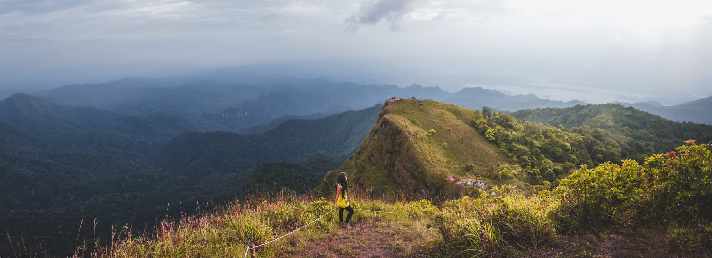

เขาสันหนอกวัวอยู่ในเขต[อุทยานแห่งชาติเขาแหลม จังหวัดกาญจนบุรี](https://goo.gl/maps/xTzSjcVfULo) ทริปนี้ค่อนข้างสั้น เพราะขึ้นไปนอนเพียงแค่คืนเดียวก็เพียงพอ และเดินไม่ยากมาก มีช่วงชันแบบเหนื่อยสุดๆ ประมาณเกือบถึงจุดตั้งแคมป์สัก 2 กิโลเมตร เดินขึ้นใช้เวลาประมาณ 3 ถึง 5 ชั่วโมง และเดินขึ้นยอด 2 ยอดเพื่อชมพระอาทิตย์ขึ้นและตกอีกไม่เกินครึ่งชั่วโมง บริเวณจุดตั้งแคมป์เป็นที่ราบริมผา มีต้นไม้ประปราย สามารถมองเป็นมุมกว้างเเห็น[เขื่อนวชิราลงกรณ์](https://goo.gl/maps/nuj4p3adCWG2)ที่อยู่ใกล้ๆและผืนป่าด้านล่างออกไปได้ไกลสุดสายตา

การจองนั้นไม่ยาก [แต่มีรายละเอียดปลีกย่อยนิดหน่อย](https://www.facebook.com/อุทยานแห่งชาติเขาแหลม-330864760360387/) โดยรวมแล้วมีความเป็นระบบระเบียบดี วันที่ไปนั้น ค่ามัดจำ คนละ 100 บาท ค่าเข้าอุทยานอีกคนละไม่เกิน 100 บาท และค่าลูกหาบที่แบกได้ 30 กิโล คนละ 1,400 บาท น้ำหนักเกินกว่านั้นคิดกิโลละ 49 บาท

วันเดินทาง เริ่มต้นที่[จุดชมวิวป้อมปี่](https://goo.gl/maps/ikhTcSF4qnB2) ทางอุทยานจะเปิดให้ลงทะเบียนได้ตั้งแต่ 8 โมง ถึง 10 โมง ชั่งน้ำหนักสัมภาระ และให้ลูกหาบเอาไปเตรียมแบก เมื่อทุกอย่างพร้อม เจ้าหน้าที่จะขับรถกระบะพาเราไปจุดเริ่มเดิน ใช้เวลาประมาณ 10 นาที

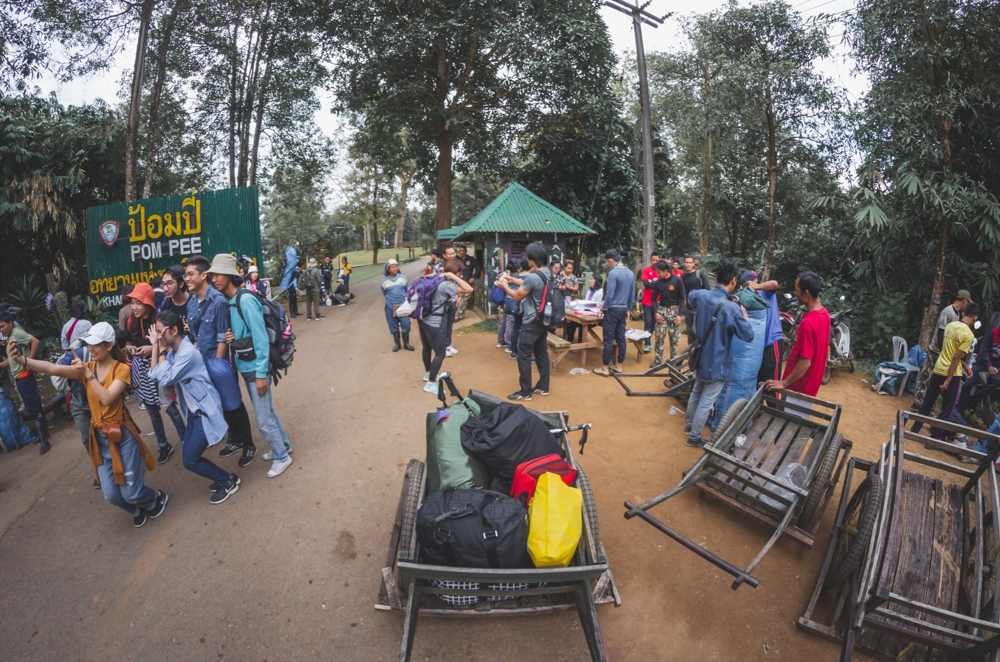

การเดินขึ้นสักหนอกวัวจะแบ่งออกเป็น 7 จุด จุดแรกคือจุดเริ่มต้น (จะขอเรียกว่าจุดที่ 0) ที่เจ้าหน้าที่ขับรถพาเรามาส่ง จากนั้นจะแบ่งเป็น 5 จุดพัก และจุดสุดท้ายคือจุดตั้งแคมป์ จาก 0 ไป 4 นั้นเดินไม่ยากมาก ระดับความชันจะไม่เยอะ แต่จาก 4 ถึง จุดค้างแรมนั้น เหนื่อยพอสมควร มีบางจุดที่เจ้าหน้าที่ต้องผูกเชือกไว้ให้นักท่องเที่ยวช่วยพยุงเพราะทางชันและลื่น

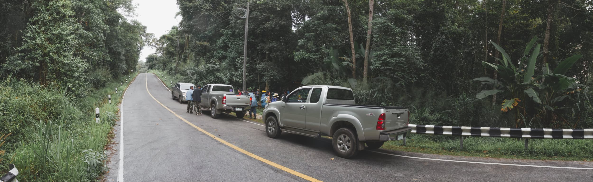

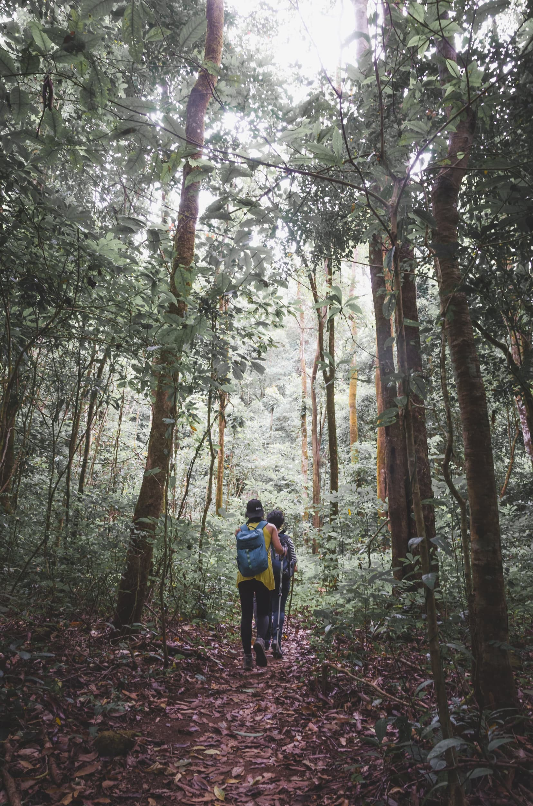

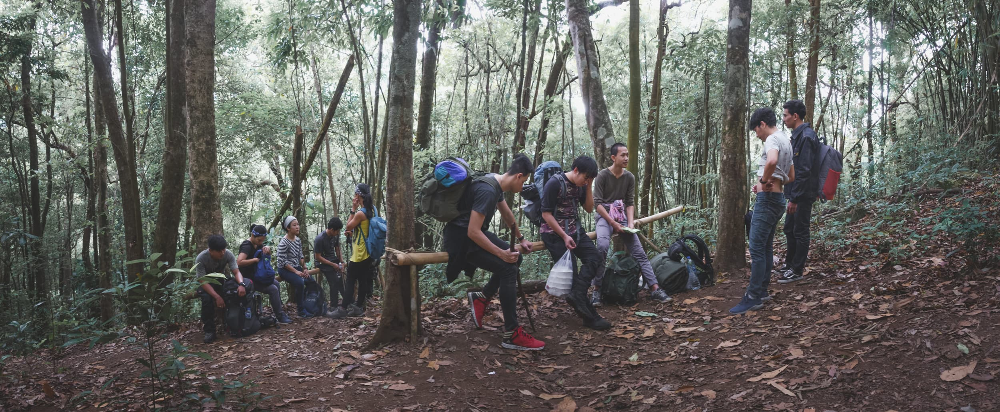

เราใช้เวลา 3 ชั่วโมงก็ถึงจุดตั้งแคมป์ รอลูกหาบด้วยการเดินเล่น ดูรอบๆและหาจุดกางเต็นท์ จากนั้น 10 - 20 นาที ลูกหาบก็ขึ้นมาถึงก็จัดแจงตั้งเตนท์, หาน้ำใส่แกลลอน และถามว่าจะให้ก่อกองไฟรึเปล่า

วันที่ไปเป็นช่วงเสาร์-อาทิตย์ คนก็เลยเยอะเป็นพิเศษ เจ้าหน้าที่บอกว่าวันนั้นมีนักท่องเที่ยวหลักร้อย บริเวณพักแรมและจุดยอดเขาจึงเต็มไปด้วยคน ถ้าใครอยากได้รูปถ่ายที่ไม่ติดคน อาจจะต้องคิดใหม่ ถ้าจะมาช่วงนี้

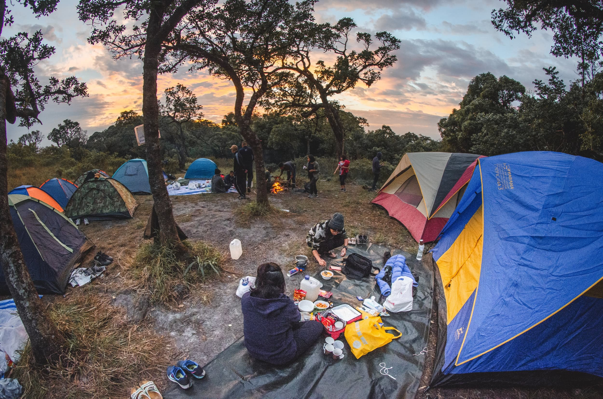

เรารอจนถึง 5 โมงเย็น แล้วจึงเดินขึ้นไปดูพระอาทิตย์ตกบนหนอกเล็กและหนอกใหญ่ การเดินขึ้นหนอกเล็ก หรือหนอกใหญ่นั้นค่อนข้างง่าย ชันแต่ระยะสั้น ขึ้นถึงยอดใช้เวลาไม่น่าเกินหนอกละ 15 ถึง 20 นาที แต่โชคร้าย วันที่ไปเมฆเยอะทั้งยามเย็นและรุ่งเช้า ทำไห้ไม่ได้เห็นพระอาทิตย์ขึ้นและตกเลย แต่ยังดีที่มีฟ้าระเบิดให้เห็นสวยงามทีเดียว

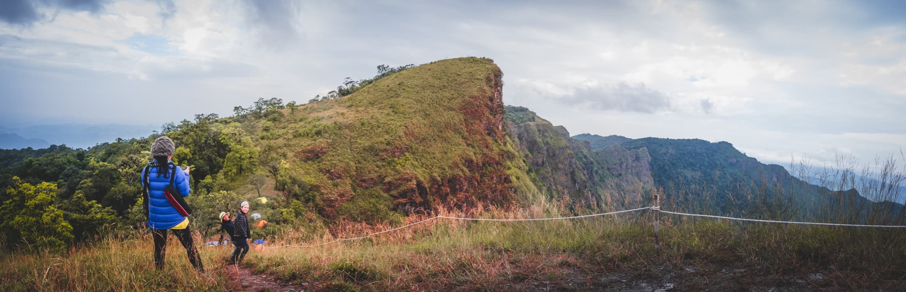

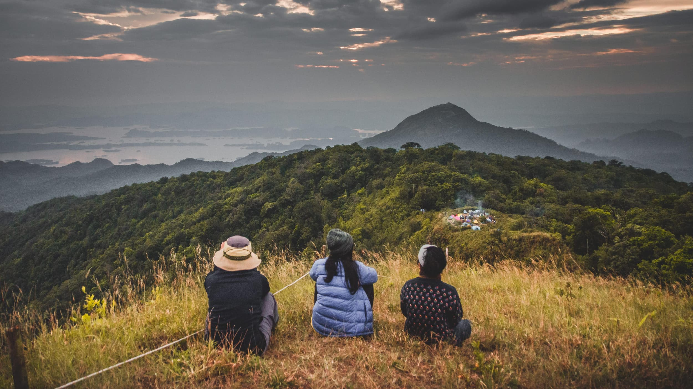

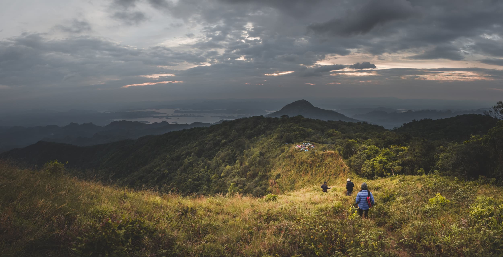

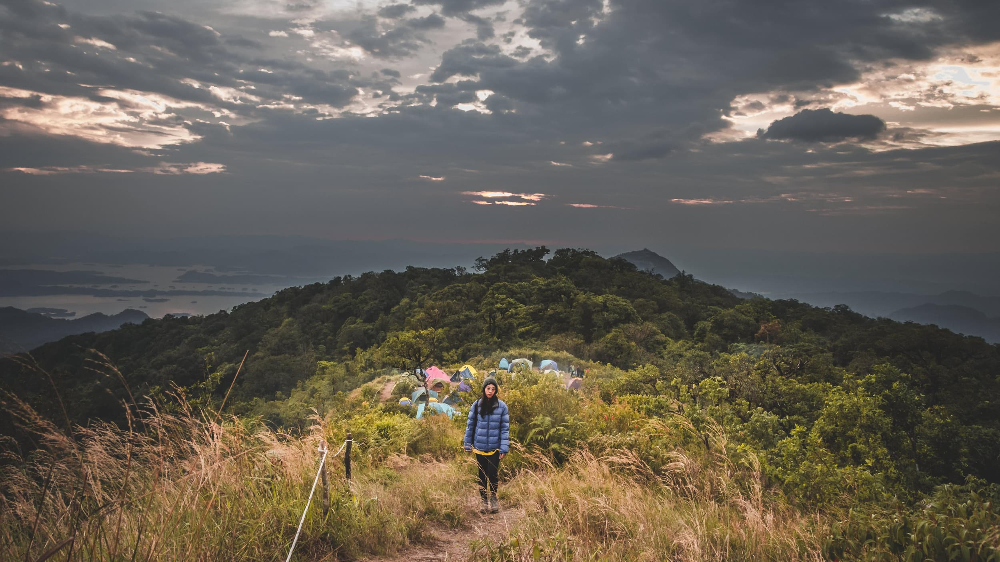

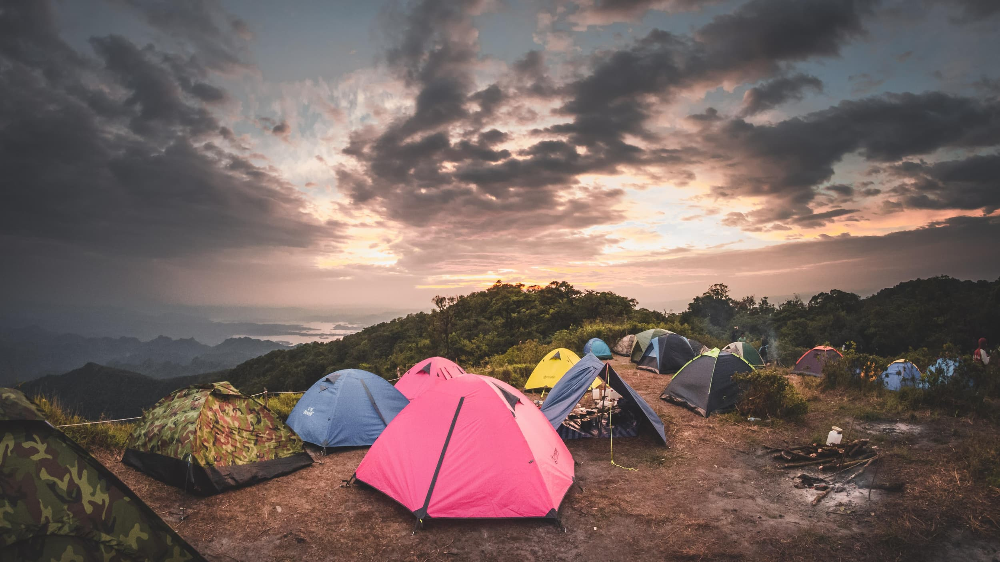

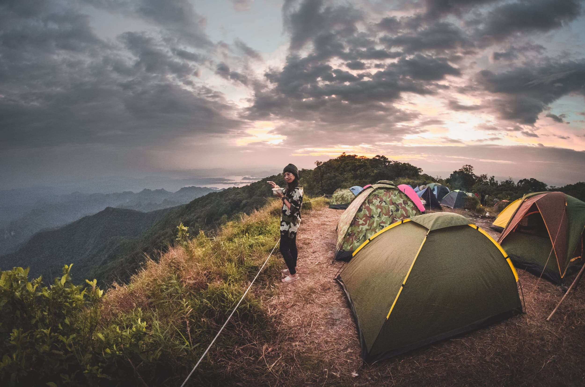

แย่ที่สุดคือตอนกลางคืนเพราะลมแรงมาก ด้วยที่ตัวเตนท์ที่เอาไปก็ชำรุดอยู่ก่อนแล้ว เจอแรงลมขนาดนี้ก็เลยพัง หมุดหลุด เสาหลุด เจ้าหน้าที่ต้องเข้ามาช่วยซ่อมเตนท์ให้ (แต่สุดท้ายก็พังอยู่ดี) ถามเจ้าหน้าที่เช้าวันรุ่งขึ้นได้ความว่า ลมวันนี้แรงที่สุดเทียบกับวันก่อนๆหน้า(อาจเป็นผลกระทบจากหางปาบึก) หลังจากที่ซ่อมเตนท์นี้ ก็ต้องไปซ่อมให้นักเดินทางคนอื่นๆอีกจนถึงตี 2 ถ้าฝนตกลงมาด้วย ทุกอย่างคงเละเทะไปหมด

การเดินลงจากเขานั้นค่อนข้างสบาย จะไม่ขอพูดถึงรายละเอียดเพราะมันก็คือทางเดียวกับที่เราเดินขึ้นนั่นแหละ เมื่อลงไปถึงจุดเริ่มต้น จะมีเจ้าหน้าที่มารอรับเรากลับป้อมปี่ กระบะไหนครบก็ล้อหมุนก่อนได้เลย ไม่ต้องรอกลุ่มเดิมคันเดิมกับขามา

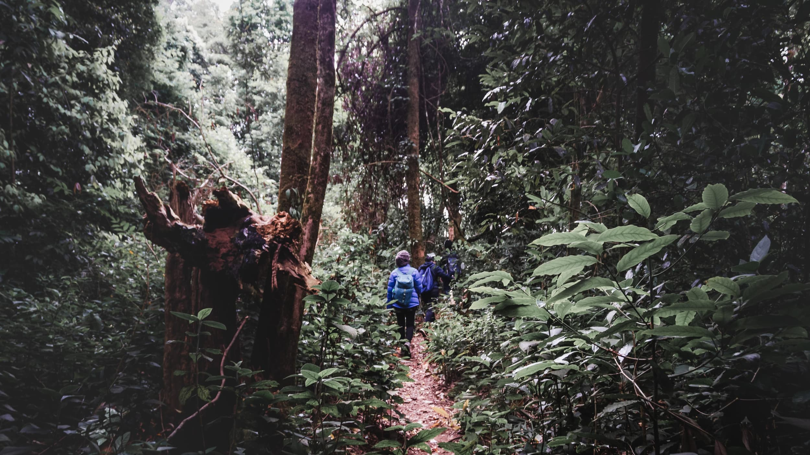

ถึงป้อมปี่ก็คืนเตนท์ ถ้าเอาขยะกลับลงมาแล้วนำไปชั่งได้หนักเกิน 1.5 กิโลกรัม จะได้เข็มกลัดเป็นรางวัล ห้องน้ำของทางอุทยานก็ทำไว้อย่างดี ถ่ายสะดวก อาบน้ำสบาย ธุระเสร็จครบก็เก็บของกลับ กทม. เป็นอันจบทริป
