Khao San Nok Wua hiking is a short trip because only one night up there is enough. Walking is not difficult there are only 2 kms before base camp that are very steep. It takes around 3 - 5 hours and not more than half an hour for each of both mountain tops. Camp area is settle around cliff which you can see panorama view of Khao Lam national park.

Booking is not easy for foreigners because you have to send some documents to officers and pay register fee beforehand, details are [here (in Thai)](https://www.facebook.com/อุทยานแห่งชาติเขาแหลม-330864760360387/).

On the appointment date, at Pom Pi view point, registration open from 8 - 10am. Weigh your belongings if need porters. When you're ready, officers will bring you to the starting point by truck which takes around 10 minutes.

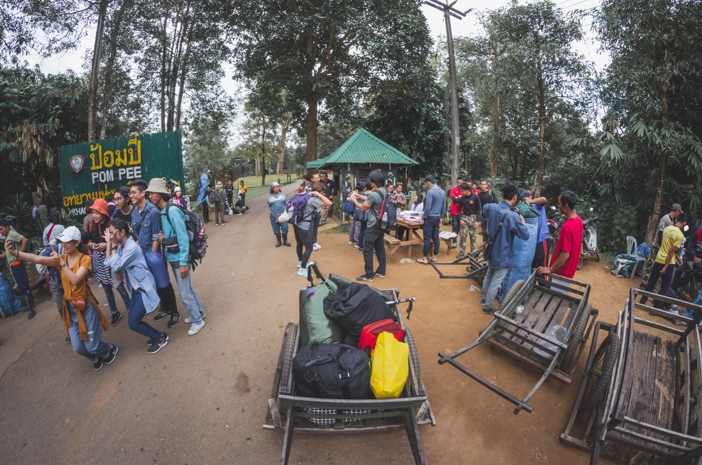

Hiking up to base camp will split into 7 rest areas. First is staring point (I will call it point No. 0) after that will be rest area No. 1 - 5 the last one will be camp area. Walking from 0 to 4 is not difficult but from No. 4 to camp is quite tiresome because there are some paths that are very steep and slippery that you need rope to get yourself go further.

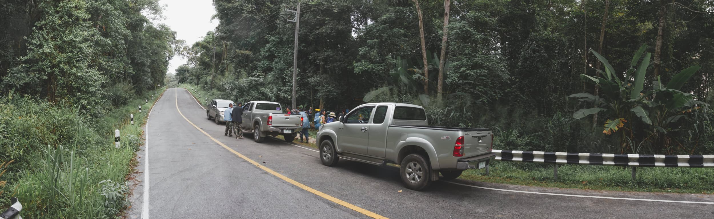

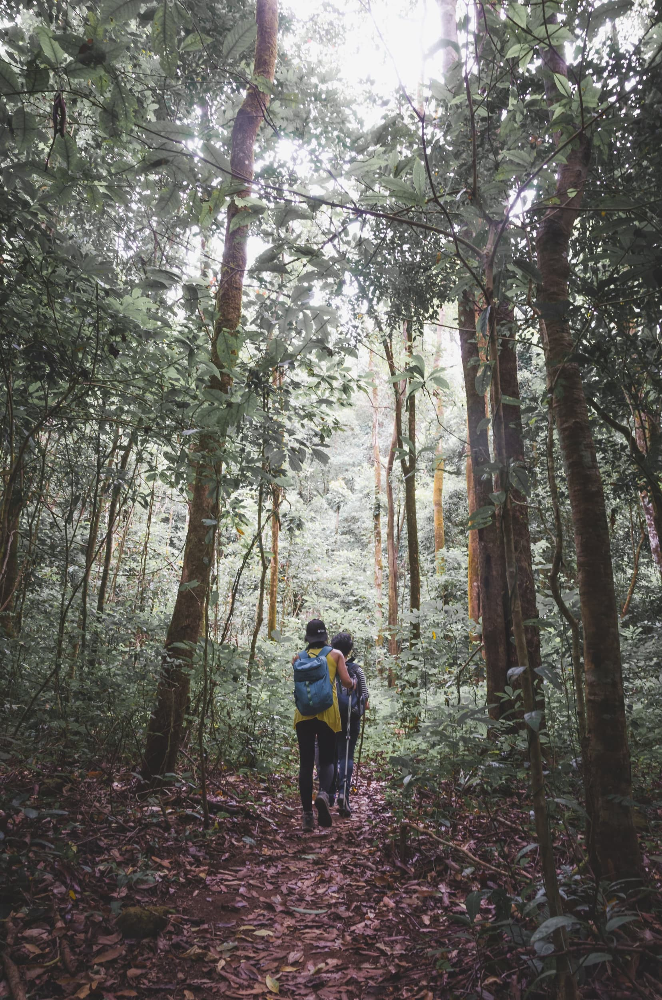

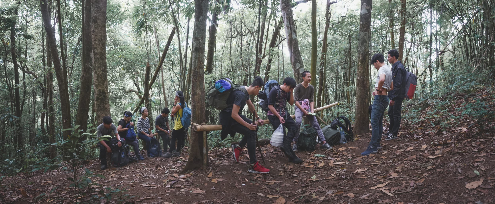

---

เขาสันหนอกวัวเป็นทริปที่ค่อนข้างสั้น เพราะขึ้นไปนอนเพียงแค่คืนเดียวก็เพียงพอ และเดินไม่ยากมาก มีช่วงชันแบบเหนื่อยสุดๆ ประมาณเกือบถึงจุดตั้งแคมป์สัก ๒ กิโลเมตร เดินขึ้นใช้เวลาประมาณ ๓ ถึง ๕ ชั่วโมง และเดินขึ้นยอด ๒ ยอดเพื่อชมพระอาทิตย์ขึ้นและตกอีกไม่เกินครึ่งชั่วโมง บริเวณจุดตั้งแคมป์เป็นที่ราบริมผา มีต้นไม้ประปราย สามารถมองเป็นมุมกว้างเห็นผืนป่าด้านล่างออกไปได้ไกลสุดสายตา และเห็นไปถึงเขื่อนที่อยู่ใกล้ๆได้เลย

การจองนั้นไม่ยาก [แต่มีรายละเอียดปลีกย่อยนิดหน่อย](https://www.facebook.com/อุทยานแห่งชาติเขาแหลม-330864760360387/) โดยรวมแล้วมีความเป็นระบบระเบียบดี วันที่ไปนั้น ค่ามัดจำ คนละ ๑๐๐ บาท ค่าเข้าอุทยานอีกคนละไม่เกิน ๑๐๐ บาท และค่าลูกหาบที่แบกได้ ๓๐ กิโล คนละ ๑๔๐๐ บาท น้ำหนักเกินกว่านั้นคิดกิโลละ ๔๙ บาท

วันเดินทาง อุทยานจะเปิดให้ลงทะเบียนได้ตั้งแต่ ๘ โมง ถึง ๑๐ โมง ชั่งน้ำหนักสัมภาระ และให้ลูกหาบเอาไปเตรียมแบก เมื่อทุกอย่างพร้อม เจ้าหน้าที่จะขับรถกระบะพาเราไปจุดเริ่มเดิน ใช้เวลาประมาณ ๑๐ นาที

การเดินขึ้นสักหนอกวัวจะแบ่งออกเป็น ๗ จุด จุดแรกคือจุดเริ่มต้น (จะขอเรียกว่าจุดที่ ๐) ที่เจ้าหน้าที่ขับรถพาเรามาส่ง จากนั้นจะแบ่งเป็น ๕ จุดพัก และจุดสุดท้ายคือจุดตั้งแคมป์ จาก ๐ ไป ๔ นั้นเดินไม่ยากมาก ระดับความชันจะไม่เยอะ แต่จาก ๔ ถึง จุดค้างแรมนั้น เหนื่อยพอสมควร มีบางจุดที่เจ้าหน้าที่ต้องผูกเชือกไว้ให้นักท่องเที่ยวช่วยพยุงเพราะทางชันและลื่น

ถึงแคมป์ ลูกหาบจะจัดแจงกางเตนท์ หาฟืนจุดไฟ และแบกน้ำใส่แกลลอนมาให้ มาถึงเร็วก็มีเวลาพักผ่อนเยอะ ก่อนที่จะถึง ๕ โมงเย็น เพื่อจะเดินไปชมพระอาทิตย์ตกที่หนอกเล็กและใหญ่

การเดินขึ้นหนอกเล็ก หรือหนอกใหญ่นั้นค่อนข้างง่าย ชันแต่ระยะสั้น ขึ้นถึงยอดใช้เวลาไม่น่าเกินหนอกละ ๑๕ ถึง ๒๐ นาที แต่โชคร้าย วันที่ไปเมฆเยอะทั้งยามเย็นและรุ่งเช้า ทำไห้ไม่ได้เห็นพระอาทิตย์ขึ้นและตกเลย แต่ยังดีที่มีฟ้าระเบิดให้เห็นสวยงามทีเดียว

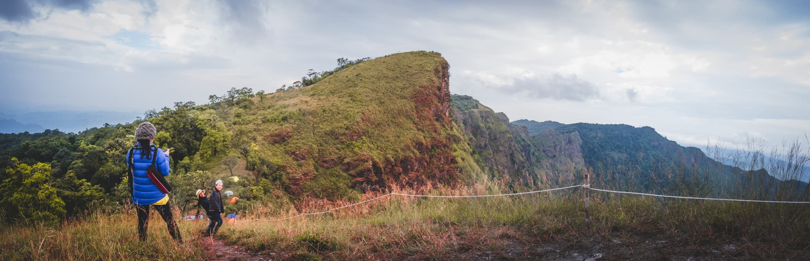

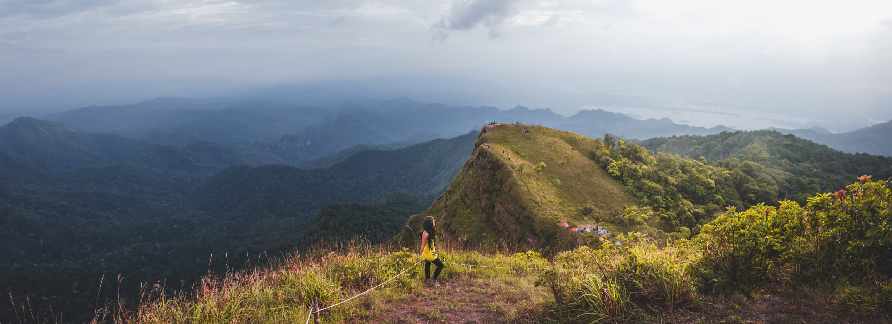

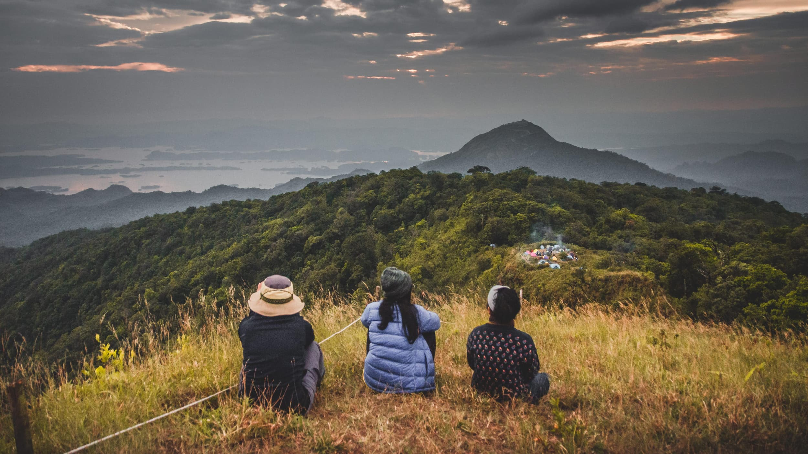

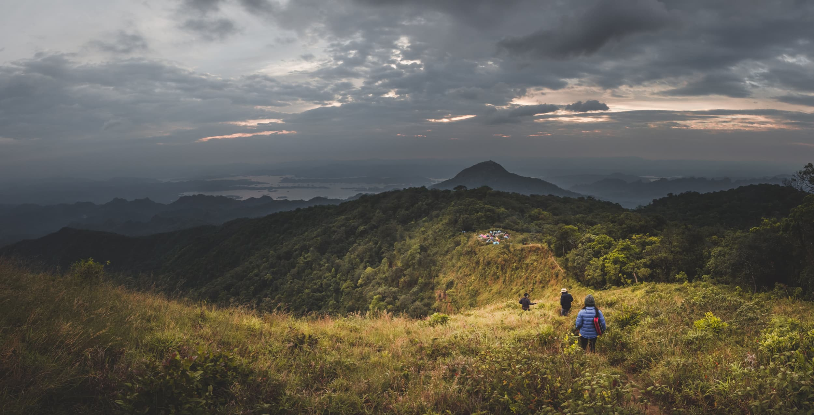

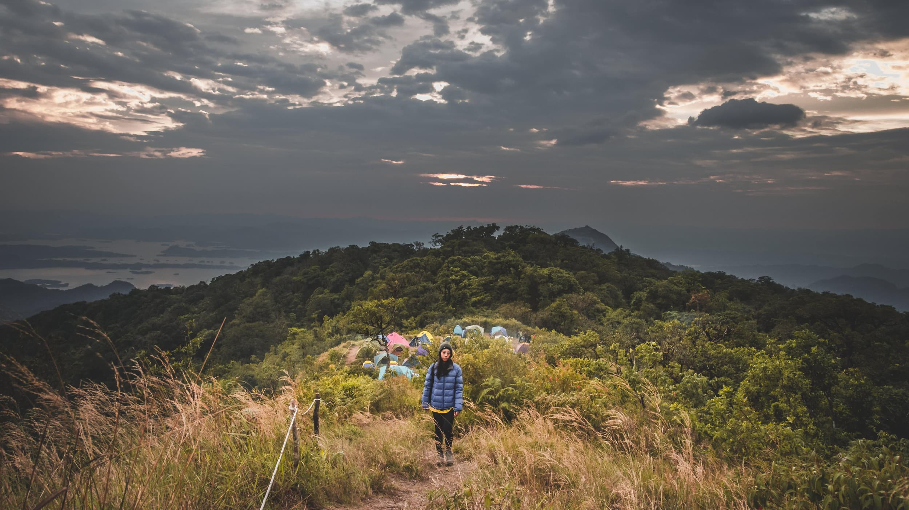

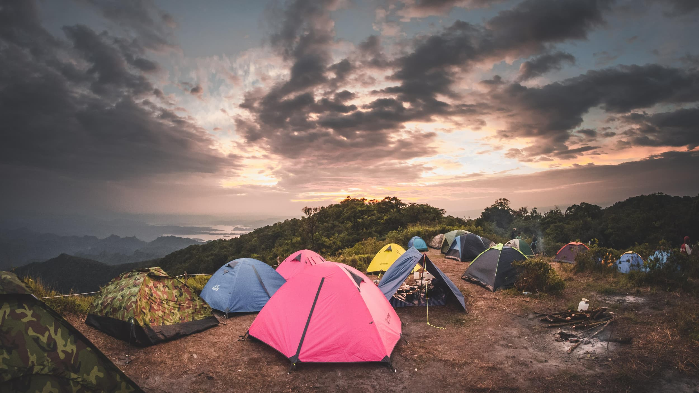

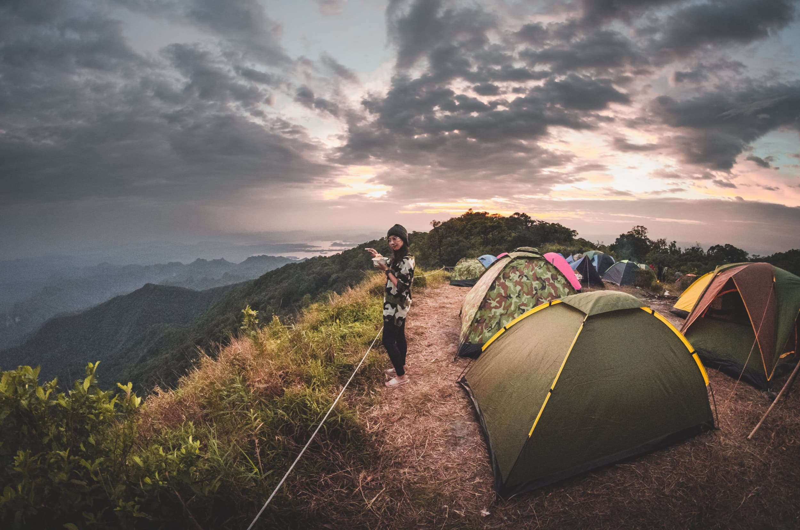

แย่ที่สุดคือตอนกลางคืนเพราะลมแรงมาก ด้วยที่ตัวเตนท์ที่เอาไปก็ชำรุดอยู่ก่อนแล้ว เจอแรงลมขนาดนี้ก็เลยพัง หมุดหลุด เสาหลุด เจ้าหน้าที่ต้องเข้ามาช่วยซ่อมเตนท์ให้ (แต่สุดท้ายก็พังอยู่ดี) ถามเจ้าหน้าที่เช้าวันรุ่งขึ้นได้ความว่า ลมวันนี้แรงที่สุดเทียบกับวันก่อนๆหน้า(อาจเป็นผลกระทบจากหางปาบึก) หลังจากที่ซ่อมเตนท์นี้ ก็ต้องไปซ่อมให้นักเดินทางคนอื่นๆอีกจนถึงตี ๒ ถ้าฝนตกลงมาด้วย ทุกอย่างคงเละเทะไปหมด

การเดินลงจากเขานั้นค่อนข้างสบาย จะไม่ขอพูดถึงรายละเอียดเพราะมันก็คือทางเดียวกับที่เราเดินขึ้นนั่นแหละ เมื่อลงไปถึงจุดเริ่มต้น จะมีเจ้าหน้าที่มารอรับเรากลับป้อมปี่ กระบะไหนครบก็ล้อหมุนก่อนได้เลย ไม่ต้องรอกลุ่มเดิมคันเดิมกับขามา

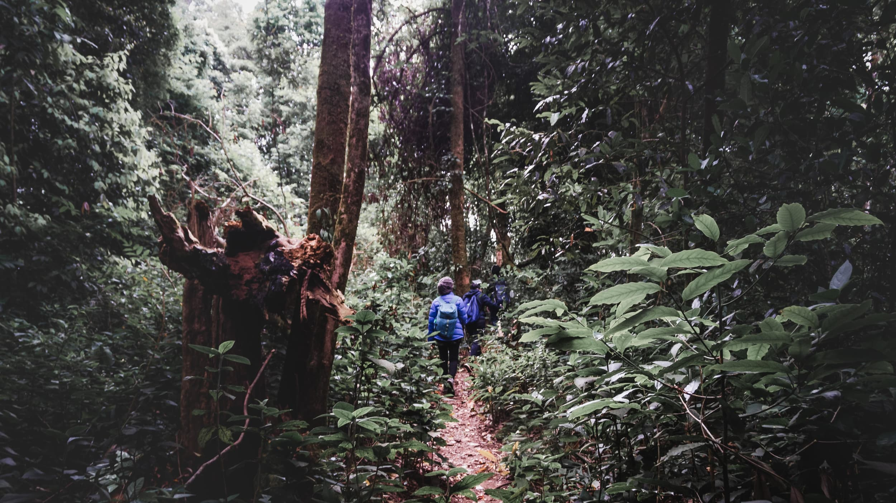

ถึงป้อมปี่ก็คืนเตนท์ ถ้าเอาขยะกลับลงมาแล้วนำไปชั่งได้หนักเกิน 1.5 กิโลกรัม จะได้เข็มกลัดเป็นรางวัล ห้องน้ำของทางอุทยานก็ทำไว้อย่างดี ถ่ายสะดวก อาบน้ำสบาย ธุระเสร็จครบก็เก็บของกลับ กทม. เป็นอันจบทริป
