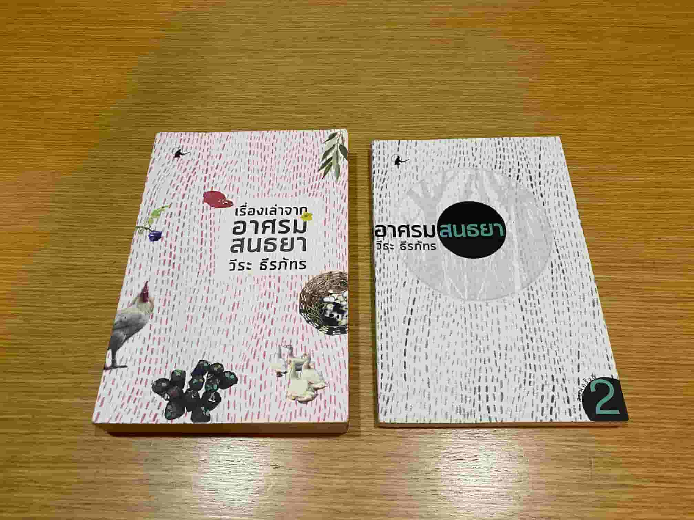

เคยได้ยินชื่อคุณวีระนานแล้ว แต่ไม่เคยได้ฟังเลยเพราะวิทยุมันไม่เอื้ออำนวย ช่วงนี้รายการแกมีให้ฟังย้อนหลังทาง Youtube ติดตามฟังก็ชอบ พอแกออกหนังสือ มีเนื้อหาที่น่าสนใจ อยากได้ความคิดความรู้ของ senior citizen ก็เลยซื้อมาอ่าน

อาศรมสนธยา คือชื่อของบ้านคุณวีระที่ไปสร้างไว้ที่ต่างจังหวัด ในเล่มจะเล่าตั้งแต่ การวางแผนที่จะสร้าง เช่น ได้ที่ดินมายังไง คุยกับช่างยังไงบ้าง ฯลฯ ไปจนถึงการล้อมต้นไม้ไปปลูก การหาต้นไม้ใหม่ไปปลูก ช่วงหลัง ๆ ที่เริ่มย้ายไปอยู่ได้แล้ว ก็เล่าเรื่องการเลี้ยงสัตว์ปีกพวก ไก่ ห่าน ด้วย

อ่านแล้วอยากมีบ้านต่างจังหวัด ได้ความรู้อย่างละนิดละหน่อย เรื่องบ้าน ต้นไม้ การเลี้ยงไก่ มีธรรมะแทรกไว้เป็นระยะ ๆ (ส่วนใหญ่ให้หัวข้อแล้วไปหาอ่านเอาเอง) สำหรับเราถือว่าเป็นการอ่านไว้เตรียมความรู้พื้นฐานการสร้างบ้านต่างจังหวัดเก็บไว้

---

109 จะลงมือทำอะไร ต้องทำความเข้าใจ ไม่ใช่กลุ้มใจ

110 จะทำให้ต้นไม้ใหญ่หลายต้นอยู่รอดได้ในหน้าแล้ง ต้องเอาเครื่องสูบน้ำจากบ่อมาฉีดรด

115 หากอยากย้ายไปอยู่บ้านต่างจังหวัดตอนอายุ 60 ควรเริ่มวางแผนตั้งแต่ 50 พอถึงเวลาจะได้ย้ายไปอยู่เลย

117 ปลูกต้นไม้ที่เหมาะสมกับธรรมชาติบริเวณนั้นจะดีที่สุด

121 หน้าฝนเหมาะกับการลงต้นไม้ใหม่

122 ต้นไม้ที่มีอายุยาวนาน เป็นสิบ ๆ ปี ก็ตายได้

134 เล่าถึงวิธีการสอน/ แนะนำ โดยที่ไม่ทำให้อีกฝ่ายรู้สึกโง่ แกยกตัวอย่างนายพูนที่สอนวิธีแกะต้นกล้าออกจากถุงดำ โดยจะไม่เข้าไปบอกตรง ๆ เลย แต่เข้าไปบอกว่าจะช่วย แล้วทำให้เห็นแทน ยิ่งมีประสบการณ์ชีวิตยิ่งต้องระวังในการพูด

174 ปลูกป่าต้องคำนึงถึงการทำให้อยู่รอดต่อไปด้วย ความยากอยู่ตรงนี้มากกว่า

180 การจะเป็นป่าอย่างแท้จริงต้องมีไม้ยืนต้นทั้งโตไวและโตช้า ไม้เนื้ออ่อนและเนื้อแข็งสลับกันไป เพราะต้นไม้แต่ละชนิดทำหน้าที่คนละอย่าง

181 ...ผลจากการปรับดินและนำปุ๋ยคอกมาลงไปเป็นร้อยกระสอบเพื่อเพิ่มความอุดมสมบูรณ์ให้กับดินในอนาคต ถ้าคิดจะทำอะไรต่อไปก่อนหน้าเกิดอานิสงศ์บุญประเสริฐตามมาแล้วครับ

ผมเห็นต้นไม้ที่ขึ้นเองตามธรรมชาติ ผุดขึ้นมาจากนื้อดินที่ผสมด้วยปุ๋ยและเมล็ดพืชพันธุ์ที่ปะปนมานอกจากหญ้า ซึ่งเป็นเรื่องปกติอยู่แล้วมีต้นอ่อนเติบโตอย่างช้าๆ แต่มั่นคงให้ผมเห็นหลายต้น

187 อิทธิบาท ๔ ฉันทะ่ วิริยะ จิตตะ วิมังสา

188 พละ ๕ ศรัทธา วิริยะ สติ สมาธิ ปัญญา

199 เมตตากถา ว่าด้วยอานิสงส์ของการแผ่เมตตา

1. หลับเป็นสุข
2. ตื่นเป็นสุข
3. ไม่ฝันร้าย
4. เป็นที่รักของมนุษย์ทั้งหลาย
5. เป็นที่รักของอมนุษย์ทั้งหลาย
6. เทวดาย่อมรักษา
7. ไฟ ยาพิษ หรือศาตราอาวุธไม่กล้ำกราย
8. จิตตั้งมั่งได้เร็ว
9. สีหน้าผ่องใส
10. ไม่หลงทำกาละ
11. เมื่อยังแทงตลอดคุณธรรมที่สูงขึ้นไปไม่ได้ ย่อมเข้าถึงพรหมโลก

210 จังหวัดเพชรบูรณ์ ฝนตกน้อยกว่าการระเหย

333 เริ่มเล่าเรื่องการเลี้ยงไก่ มีตัวนึงตาบอดด้วย

347 รับไก่มา อย่าเพิ่งปล่อยหากินตามธรรมชาติ กักบริเวณให้ปรับตัวสัก ๓ ถึง ๕ วัน

365 ไก่จะขึ้นไปนอนตามต้นไม้ ตอนกลางคืน (มีรูปให้ดูด้วย)

445 แต่ความกว้างของพื้นที่ในชนบทที่มีมากไป บางทีก็ทำให้อะไรต่อมิอะไรมันเหมือนกับมีเส้นแบ่งที่ไม่ชัดเจนระหว่าง ส่วนตัว กับส่วนรวม บุคคลสมบัติ กับสาธารณสมบัติ ไม่รู้อันไหนเป็น Private Property อันไหนเป็น Public Property แถมบางทีก็ดูยากอีกต่างหาก

การรุกล้ำเลยเป็นการขอกันกินนิด ๆ หน่อย ๆ ไม่ใช่เรื่องใหญ่โต ไม่ควรถือสาหาความกันให้เป็นปัญหา ได้เพื่อนบ้านดีก็ดีไป ถ้าเจอครบเครื่อง มักง่าย เอาแต่ได้ บวกกับหน้าด้าน แถมไม่รู้ประสีประสาเข้าไปด้วย
